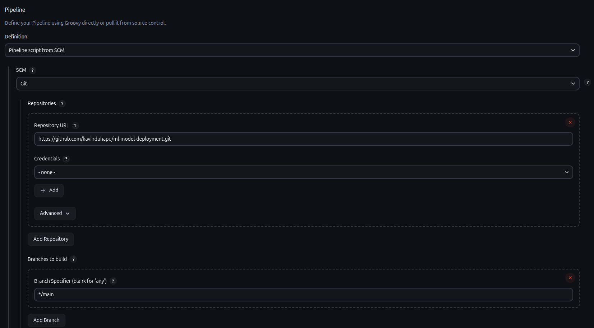
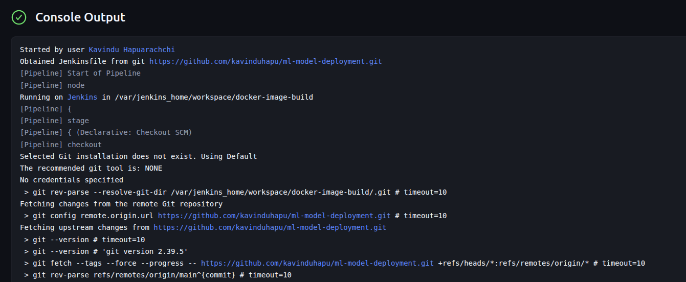
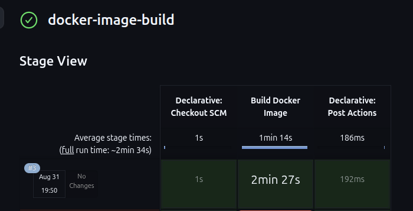
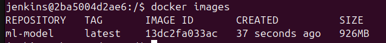

# ml-model-deployment
This repo contains development related to build ML model docker image using Jenkins CICD

# Setup instructions

* To run the pipeline and build ml-model docker image it is required to run Docker deamon on the Jenkins container.

* However by default lts images dont come with bundled docker-cli

* To avoid this following steps can be used as per the 
[docs](https://www.jenkins.io/doc/book/installing/docker/).
1. Create a network
```bash
docker network create jenkins
```

2. Create Docker in Docker (DinD) container
```bash
docker run --name jenkins-docker --rm --detach \
  --privileged --network jenkins --network-alias docker \
  --env DOCKER_TLS_CERTDIR=/certs \
  --volume jenkins-docker-certs:/certs/client \
  --volume jenkins-data:/var/jenkins_home \
  --publish 2376:2376 \
  docker:dind --storage-driver overlay2
```

3. Create custom jenkins image with docker cli and additional plugins installed.
```bash
FROM jenkins/jenkins:lts
USER root
RUN apt-get update && apt-get install -y lsb-release ca-certificates curl && \
    install -m 0755 -d /etc/apt/keyrings && \
    curl -fsSL https://download.docker.com/linux/debian/gpg -o /etc/apt/keyrings/docker.asc && \
    chmod a+r /etc/apt/keyrings/docker.asc && \
    echo "deb [arch=$(dpkg --print-architecture) signed-by=/etc/apt/keyrings/docker.asc] \
    https://download.docker.com/linux/debian $(. /etc/os-release && echo \"$VERSION_CODENAME\") stable" \
    | tee /etc/apt/sources.list.d/docker.list > /dev/null && \
    apt-get update && apt-get install -y docker-ce-cli && \
    apt-get clean && rm -rf /var/lib/apt/lists/*
USER jenkins
RUN jenkins-plugin-cli --plugins "docker-workflow json-path-api"
```

4. Build custom docker image
```bash
docker build -t myjenkins .
```

5. Run custom docker container. This will use DinD docker container as docker deamon.
```bash
docker run --name jenkins --restart=on-failure --detach \
  --network jenkins --env DOCKER_HOST=tcp://docker:2376 \
  --env DOCKER_CERT_PATH=/certs/client --env DOCKER_TLS_VERIFY=1 \
  --publish 8080:8080 --publish 50000:50000 \
  --volume jenkins-data:/var/jenkins_home \
  --volume jenkins-docker-certs:/certs/client:ro \
  myjenkins

```

6. Open `http://localhost:8080/` in your browser. If its the first time accessing Jenkins you will be asked to provide old Jenkins password. You can find it using below.

```bash
docker exec -it container_id bash
cat /var/jenkins_home/secrets/initialAdminPassword
```

7. Then go to UI and click on New Item and select type as `Pipeine` and specify a name. Provide the below details. Then hit save.


8. Click on `Build Now`

9. You can track the progress on console output




10. Once completed you can verify the docker image by running below.
```bash
docker exec -it container_id bash
docker images
```
